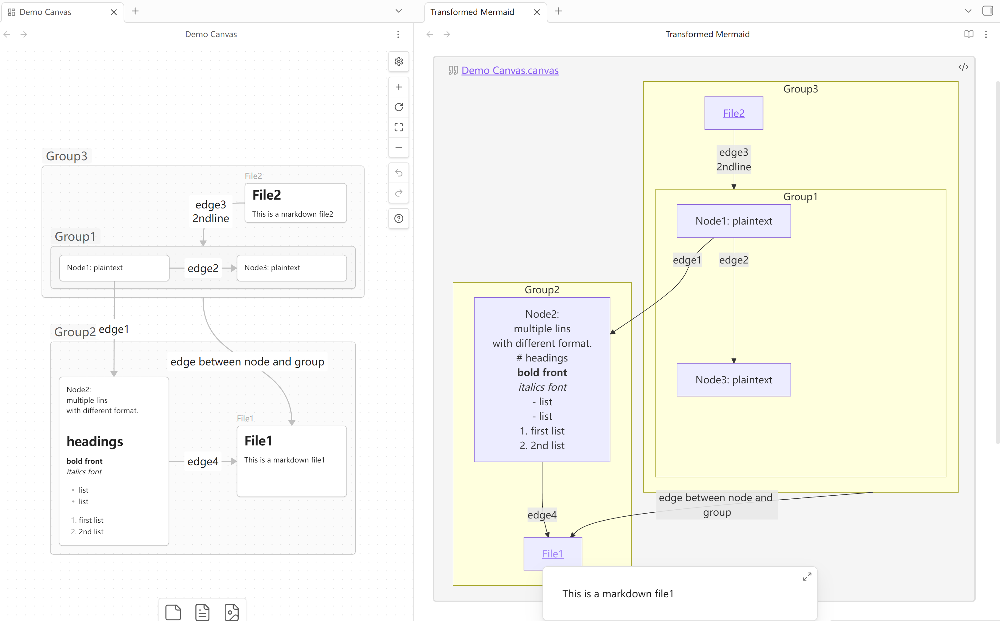

# Canvas2Mermaid

> **Convert Canvas files to Mermaid flowcharts with internal links and group support**

Transform your Canvas files into beautiful Mermaid flowcharts while preserving internal links, groups, and visual relationships. Perfect for documentation, presentations, and sharing your knowledge graphs.

## ✨ Features

- 🔄 **Seamless Conversion**: Convert Canvas files to Mermaid syntax with one command
- 🔗 **Link Preservation**: Maintain internal links in generated diagrams
- 🎯 **Group Support**: Preserve Canvas groups and visual organization
- 📋 **Clipboard Integration**: Copy Mermaid code directly to clipboard
- 🎨 **Customizable Direction**: Configure flowchart direction (TB, LR, BT, RL)
- ⚡ **Performance Optimized**: Efficient processing for large Canvas files

## 🖼️ Screenshots

*Left: Original Canvas file, Right: Generated Mermaid diagram*

## 🚀 Installation

### From Community Plugins

1. Open Settings → Community plugins
2. Disable Safe mode
3. Click Browse and search for "Canvas2Mermaid"
4. Click Install
5. Enable the plugin

### Manual Installation

1. Download `main.js` and `manifest.json` from the [latest release](https://github.com/haclkmans/canvas2mermaid/releases/latest)
2. Create a new folder `canvas2mermaid` in your vault's plugins directory
3. Copy the downloaded files into the `canvas2mermaid` folder
4. Restart the app
5. Enable the plugin in Settings → Community plugins

## 📖 Usage

### Basic Conversion

1. Open a Canvas file
2. Open Command Palette (`Ctrl/Cmd + P`)
3. Type "Convert Canvas to Mermaid" and select the command
4. The Mermaid code will be automatically copied to your clipboard

### Group Support

- Canvas groups are converted to Mermaid subgraphs
- Nested groups are preserved
- Group titles are maintained
- ⚠️ Note: Overlapping groups are not supported due to Mermaid limitations

### Link Handling

- Internal links are preserved
- External links remain clickable
- Link texts are maintained

## ⚙️ Settings

Access via Settings → Community plugins → Canvas2Mermaid

### Flowchart Direction
- **TB**: Top to Bottom (default)
- **LR**: Left to Right
- **BT**: Bottom to Top
- **RL**: Right to Left

### Clipboard Options
- Enable/disable automatic copying
- Choose output format

## 🔧 Commands

| Command | Description | Shortcut |
|---------|-------------|----------|
| `Convert Canvas to Mermaid` | Convert current Canvas to Mermaid syntax | None |
| `Refresh Canvas Callouts` | Update callout display in Canvas | None |

## 🤝 Contributing

Contributions are welcome! Please see our [Contributing Guide](CONTRIBUTING.md).

## 📄 License

This project is licensed under the MIT License - see the [LICENSE](LICENSE) file for details.